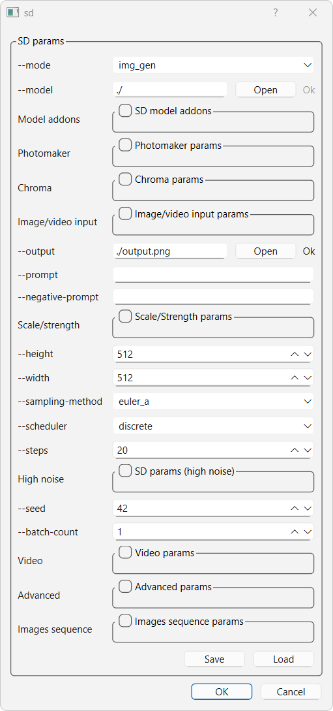
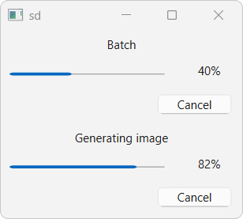

# stable-diffusion.cpp : GUI of command line interface

This repository is a fork of [stable-diffusion.cpp](https://github.com/leejet/stable-diffusion.cpp). It adds a GUI interface to the executable generating examples. The GUI act as a local server. Examples can be generated continuously without reloading the model.

<p align="center">
  
</p>

- Only requires installation of Qt (5 or 6)

- To enable, use CMake options:
  
  ```cmake
  -DSD_BUILD_EXAMPLES=ON -DSD_EXAMPLES_GLOVE_GUI=ON
  ```

- Comes with precompiled binaries ready to use for Windows requiring no further installation. 
  
  - **-bin-win-avx2-x64** : Compatible with (most) x64 CPU
  
  - **-bin-win-cuda12-x64** : Compatible with Nvidia graphic card GeForce GTX 950 and after (ie: RTX series are compatible).

- The models are reloaded only if their parameters are changed. If any of the *Context options* parameters is changed, then the models are reloaded.
  
  - Possibility to generate images with different prompts/size on the fly

- Parameters saving as *json*, upon acceptance (*Ok* button):
  
  - The parameters are saved automatically at the execution location
  - The parameters are also copied automatically to the directory of the <code>--output</code> path

- Parameters loading:
  
  - The last used parameters are automatically loaded at launch
  - Parameters can be loaded
    - by using the *Load* button
    - or: <code>sd -glove 'path-to-parameters-file'</code>
	
- Parameters filtering:

  - The parameters can be filtered by name
  
- Parameters parsing

  - A command line can be pasted using the *Parse* button

- Progress :
  
  - Monitoring of progression
  - Possibility to cancel

<p align="center">
  
</p>

- Warning/error messages display

- Possibility to generate images sequences using **img_gen** mode and by setting the output image to be the same as the input image. See **Images sequence** parameters.

## Misc

- By default, the setup is configured for a desktop application (i.e. : launch using executable icon on desktop).
  One can disable this default behaviour by additionaly setting the following CMake command:
  
  ```cmake
  -DSD_EXAMPLES_GLOVE_GUI_DESKTOP=OFF
  ```
  
  In this case, the GUI will be accessible using the following CLI argument:
  
  ```sh
  sd -glove
  ```
  
  and the terminal will be visible.
  In both cases, CLI arguments of SD examples remain operational.

- On Windows, if DLLs are missing, go to the <code>sd</code> executable directory and apply the command:
  
  ```sh
  windeployqt.exe sd.exe
  ```

## License

The interface is licensed under GPL-3.0, when using <code>-DSD_EXAMPLES_GLOVE_GUI=ON</code>. Otherwise, the MIT license of the master repository applies.
